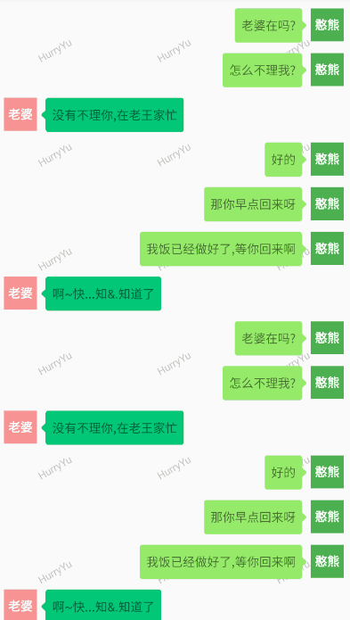
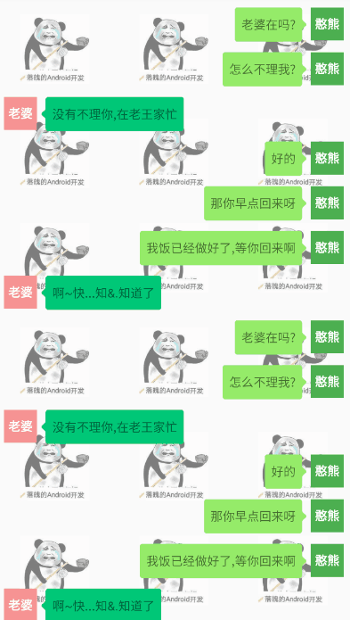

# RecyclerView水印框架

使用`RvWatermark`能够方便、快速、优雅的给`RecyclerView`添加背景水印，使用它可以让我们摆脱技术细节以及繁琐的数学计算，更加专注业务开发。

`RvWatermark`默认提供了`文字水印`和`图片水印`的实现，效果如下：

|  |  |
| :------------------------------------------: | :----------------------------------------------: |
|                   文字水印                   |                     图片水印                     |

默认效果中，水印会跟随滑动，当然你可以设置水印固定，在后面的使用方法中会详细说明。

当然，如果您希望绘制自定义的内容作为水印，可参考**自定义水印**

## 一、快速集成

### 1.1、Gradle引入

```xml
implementation 'com.hurryyu:RvWatermark:1.1'
```

### 1.2、简单使用

您仅需短短两行代码，即可让`RecyclerView`支持文字或图片水印。

#### 1.2.1、文字水印

**Kotlin**

```kotlin
val drawable = TextWatermarkDrawable.build("HurryYu")
RvWatermark.build(drawable).bindToRecyclerView(recyclerView)
```

**Java**

```java
TextWatermarkDrawable drawable = new TextWatermarkDrawable.Builder("HurryYu").build();
new RvWatermark.Builder(drawable).build().bindToRecyclerView(recyclerView);
```

总结起来就是两步：

1. 创建`TextWatermarkDrawable`对象
2. 创建`RvWatermark`对象并调用`bindToRecyclerView()`方法

#### 1.2.2、图片水印

**Kotlin**

```kotlin
val bitmap = BitmapFactory.decodeResource(resources, R.drawable.icon_android)
val drawable = BitmapWatermarkDrawable.build(bitmap)
RvWatermark.build(drawable).bindToRecyclerView(recyclerView)
```

**Java**

```java
Bitmap bitmap = BitmapFactory.decodeResource(getResources(), R.drawable.icon_android);
BitmapWatermarkDrawable drawable = 
    new BitmapWatermarkDrawable.Builder(bitmap).build();
new RvWatermark.Builder(drawable).build().bindToRecyclerView(recyclerView);
```

使用起来相当简单。

## 二、属性详解

### 2.1、公共属性

您可以自定义水印列数、水印行高以及水印是否跟随`RecyclerView`滑动，它们的参数名分别是：`watermarkColumnNumber`、`watermarkRowHeight`、`isFollowScroll`。下面给出设置代码：

**Kotlin**

```kotlin
RvWatermark.build(drawable) {
    isFollowScroll(true)
    watermarkColumnNumber(3)
    watermarkRowHeight(120)
}.bindToRecyclerView(recyclerView)
```

**Java**

```java
new RvWatermark.Builder(drawable)
        .isFollowScroll(true)
        .watermarkColumnNumber(3)
        .watermarkRowHeight(120)
        .build()
        .bindToRecyclerView(recyclerView);
```

### 2.2、文字水印特有属性

文字水印的属性设置在创建`TextWatermarkDrawable`进行，如果您想设置多个不同文字内容的水印，可在`build`中传入多个字符串，若您只需显示同一文本内容，直接传入字符串即可。

除此之外，我们还可以设置：

- `watermarkTextColor`水印字体颜色
- `watermarkTextSize`水印字体大小
- `watermarkTextAlpha`水印字体透明度
- `watermarkTextDegrees`水印字体旋转角度

下面给出设置代码：

**Kotlin**

```kotlin
val drawable = TextWatermarkDrawable.build("HurryYu") {
    watermarkTextAlpha(0.5F)
    watermarkTextColor(Color.GRAY)
    watermarkTextDegrees(-30F)
    watermarkTextSize(12F)
}
```

**Java**

```java
TextWatermarkDrawable drawable =
        new TextWatermarkDrawable.Builder("HurryYu")
                .watermarkTextAlpha(0.5F)
                .watermarkTextColor(Color.GRAY)
                .watermarkTextDegrees(-30)
                .watermarkTextSize(12F)
                .build();
```

### 2.3、图片水印特有属性

- `watermarkBitmapScaleValue`缩放比
- `watermarkBitmapAlpha`透明度
- `watermarkBitmapDegrees`旋转角度

下面给出设置代码：

**Kotlin**

```kotlin
val drawable = BitmapWatermarkDrawable.build(bitmap) {
    watermarkBitmapAlpha(0.5F)
    watermarkBitmapDegrees(0F)
    watermarkBitmapScaleValue(1F)
}
```

**Java**

```java
BitmapWatermarkDrawable drawable =
        new BitmapWatermarkDrawable.Builder(bitmap)
                .watermarkBitmapAlpha(0.5F)
                .watermarkBitmapDegrees(0)
                .watermarkBitmapScaleValue(1)
                .build();
```

## 三、自定义水印

如果本框架提供的水印样式不符合您的要求，您可以自定义。只需要继承`BaseWatermarkDrawable`类，在`draw`方法中进行绘制就可以了。您可以通过`currentDrawIndex()`方法来得知您当前正在绘制第几个下标的水印；您可以通过`bounds`（`java`中需要调用`getBounds()`方法）来获得绘制内容的位置。

注意，`Rect`中`left`、`top`、`right`、`bottom`都是相对于`RecyclerView`左上角的坐标位置，您可以通过`rect.bottom - (rect.bottom - rect.top) / 2F`来得到绘制区域的中点坐标。

## 四、谢谢

使用过程中有任何问题，欢迎与我取得联系：

Email：cqbbyzh@gmail.com

QQ：1037914505